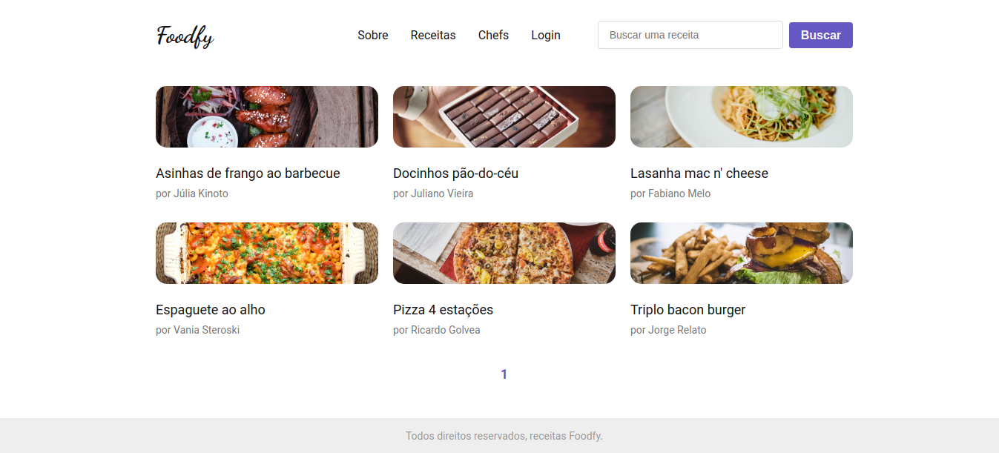
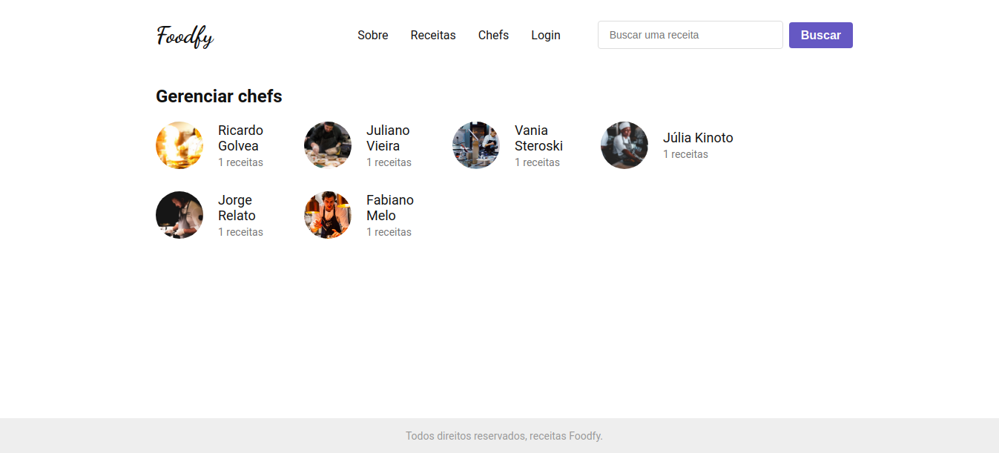
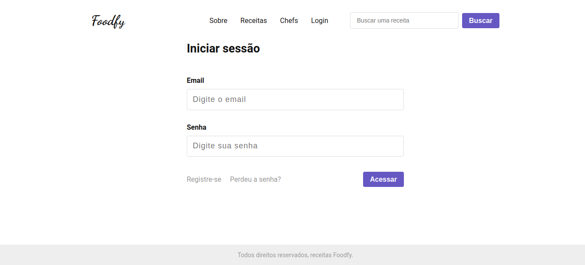
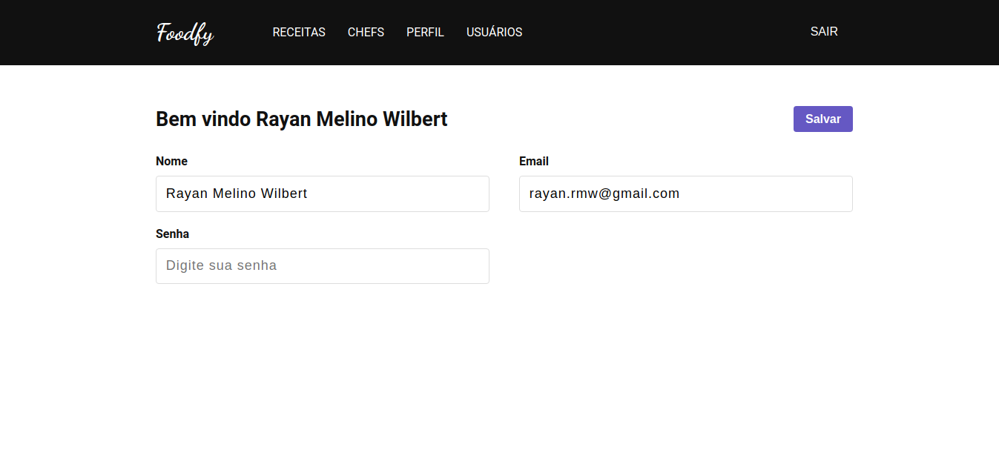

<p align="center">
   
</p>

# Foodfy


[](https://github.com/Raymw1)
[](#)
[](https://github.com/Raymw1/foodfy/stargazers)
[](https://github.com/Raymw1/foodfy/network/members)
[](https://github.com/Raymw1/foodfy/graphs/contributors)


> Take your culinary skills to the next level. Cook, Explore & Manage Recipes.

<br />

<p align="center"></p>
<p align="center"></p>
<p align="center"></p>
<p align="center"></p>
<p align="center"></p>


---

# :pushpin: Table of Contents

* [Features](#rocket-features)
* [Installation](#construction_worker-installation)
* [Getting Started](#runner-getting-started)
* [FAQ](#postbox-faq)
* [Found a bug? Missing a specific feature?](#bug-issues)
* [License](#closed_book-license)


# :rocket: Features

* 👩🏽‍🍳 Explore recipes and find amazing chefs.
* 🍕 Create an account to manage recipes, chefs and users.
* 📨 As an administrator of the platform, you're able to invite other users.

# :construction_worker: Installation

**You will need to install [Node.js](https://nodejs.org/en/download/) first and [Yarn](https://yarnpkg.com/) if you prefer, then in order to clone the project via HTTPS, run this command:**

```git clone https://github.com/Raymw1/foodfy.git```

SSH URLs provide access to a Git repository via SSH, a secure protocol. If you have a SSH key registered in your Github account, clone the project using this command:

```git clone git@github.com:Raymw1/foodfy.git```

**Install dependencies**

* NPM: ```npm install```
* Yarn: ```yarn install```

Create your environment variables based on the examples of ```.env.local```

```cp .env.local .env```

After copying the examples, make sure to fill the variables with new values.

# :runner: Getting Started

**Manually setup**

You may prefer to manually configure the database and the application.

Install [Postgres](https://www.postgresql.org/) to create a database.

Execute the follow command to create tables, relationships and procedures:

```npm run configure-db```

**Running seed**

In order to prepare the database and also run the application, use the seed file in the seed folder.

You can generate the data already prepared running the ```seed.js``` file:

```npm run seed-db```

Or generating random data running the ```randomSeed.js``` file:

```npm run random-seed-db```

**Be sure to fill the Unsplash access key in ```.env``` to use their API**

Run the following command in order to start the application in a development environment:

```npm run dev``` **or** ```yarn dev```

# :postbox: Faq

**Question:** What are the technologies used in this project?

**Answer:** The tecnologies used in this project are [NodeJS](https://nodejs.org/en/) + [Express Framework](http://expressjs.com/en/) to handle the server & [Nunjucks](https://mozilla.github.io/nunjucks/templating.html) to develop amazing views.
##

**Question:** Are all kind of users able to create and update chefs or recipes?

**Answer:** The application has two kind of users: Visitors and Administrators. As a administrator, you're able to create, update and view all the data related to recipes, chefs and also other users. Visitors can also access the admin platform but they don't have access to the views responsable to create and update data.

# :bug: Issues

Feel free to **file a new issue** with a respective title and description on the the [Foodfy](https://github.com/Raymw1/foodfy/issues) repository. If you already found a solution to your problem, **i would like to review your pull request**!

# :closed_book: License

Released in 2020.
This project is under the [MIT license](https://github.com/Raymw1/foodfy/blob/master/LICENSE).

Made with love by [Raymw1](https://github.com/Raymw1) 💜🚀
